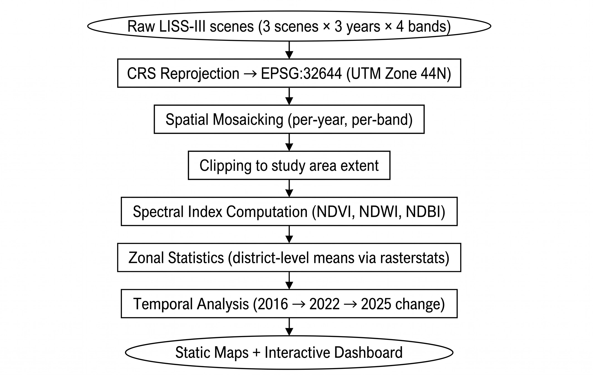

# One Health Environmental Risk Monitoring - Uttarakhand
## Project Report

**Author:** Abhay Pratap  
**Institution:** Vellore Institute of Technology, B.Tech CSE (Health Informatics)  
**Study Period:** 2016 - 2025  
**Study Area:** Dehradun · Haridwar · Pauri Garhwal, Uttarakhand, India

---

## Table of Contents

1. [Introduction](#1-introduction)
2. [Objectives](#2-objectives)
3. [Study Area](#3-study-area)
4. [Data Sources](#4-data-sources)
5. [Environmental Indices](#5-environmental-indices)
6. [Methodology](#6-methodology)
7. [Results](#7-results)
8. [Discussion](#8-discussion)
9. [Conclusions](#9-conclusions)
10. [SDG Alignment](#10-sdg-alignment)
11. [Limitations and Future Work](#11-limitations-and-future-work)

---

## 1. Introduction

### 1.1 The One Health Framework

One Health is the simple idea that human health, animal health, and environmental health are all tied together. If the water, soil, forests, or air that a community shares with its livestock start to degrade, it doesn't stay contained, it shows up eventually as disease, poor nutrition, or new zoonotic risks.

The problem is that most public health work in India doesn't look at it this way. Hospital data (HMIS) is tracked on its own, livestock disease numbers are tracked on their own, and land-use change usually isn't part of either conversation. There's no routine tool that puts all three together at the district or block level, which is the gap this project tries to fill.

### 1.2 Problem Statement

Uttarakhand is changing fast. Dehradun's Doon Valley is urbanising, Haridwar's Terai belt is seeing more intensive farming, and Pauri Garhwal's hill tracts are going through their own shifts in land use. All of this affects vegetation, water bodies, and built-up area, and in turn affects vector breeding grounds, drinking water quality, grazing land, and disease risk.

Despite this, nobody has really quantified these changes at the district level over time, or connected them to health and livestock data in a way planners and field workers could actually use.

### 1.3 Proposed Solution

This project builds a geospatial pipeline that:

1. Derives three environmental indices (NDVI, NDWI, NDBI) from Resourcesat-2 LISS-III satellite imagery for 2016, 2022, and 2025 across three study districts.
2. Computes a **One Health Risk Score (OHRS)** that combines vegetation loss and urban expansion into a single 0-10 index per district.
3. Integrates Census 2011, HMIS health data, and Animal Husbandry statistics into a unified spatial dataset.
4. Delivers the results as publication-quality static maps, statistical charts, and a fully interactive web-based atlas hosted on GitHub Pages.

---

## 2. Objectives

### Primary Objective

To develop a remote sensing and GIS-based decision support framework for environmental health risk assessment in three districts of Uttarakhand, demonstrating the One Health approach by connecting satellite-derived land-surface metrics with human health and livestock data.

### Specific Objectives

| # | Objective |
|:---:|---|
| O1 | Acquire and pre-process multi-temporal Resourcesat-2 LISS-III satellite imagery (2016, 2022, 2025) for the study districts |
| O2 | Compute spectral indices, NDVI, NDWI, NDBI, and perform zonal statistics at the district level |
| O3 | Quantify vegetation change, waterbody dynamics, and urban expansion between 2016 and 2025 |
| O4 | Integrate Census 2011 demographic data, HMIS health indicators, and livestock statistics into a district-level dataset |
| O5 | Develop a composite One Health Risk Score (OHRS) and validate its spatial distribution |
| O6 | Produce a publicly accessible interactive atlas that allows non-technical stakeholders to explore the data |

---

## 3. Study Area

### 3.1 Overview

The three study districts, **Dehradun**, **Haridwar**, and **Pauri Garhwal**, form a contiguous region in the north-western part of Uttarakhand, spanning from the Himalayan foothills to the Indo-Gangetic plain.

### 3.2 District Profiles

#### Dehradun

| Attribute | Value |
|---|---|
| Area | ~3,088 km² |
| Population (2011) | 16,96,694 |
| Population Density | ~550 / km² |
| Literacy Rate | 74.23% |
| Terrain | Mixed, Doon Valley plains, Mussoorie ridge, Shivalik hills |
| Key characteristics | State capital; rapid urban and peri-urban expansion; forest-covered northern hills; Rispana and Bindal river basins |

#### Haridwar

| Attribute | Value |
|---|---|
| Area | ~2,360 km² |
| Population (2011) | 18,90,422 |
| Population Density | ~801 / km² |
| Literacy Rate | 62.33% |
| Terrain | Flat Terai and Bhabar belt |
| Key characteristics | Highest population density of the three; major pilgrimage centre; intensive agriculture; Ganga river corridor; significant industrial belt |

#### Pauri Garhwal

| Attribute | Value |
|---|---|
| Area | ~5,438 km² |
| Population (2011) | 6,87,271 |
| Population Density | ~126 / km² |
| Literacy Rate | 72.01% |
| Terrain | Mid-Himalayan hills and valleys |
| Key characteristics | Largest area; lowest density; significant forest cover; pastoralism and terraced agriculture; ongoing out-migration trend |

### 3.3 Environmental Context

The study area covers a big elevation range, from the Ganges plains in Haridwar (~275 m) through the Doon Valley in Dehradun (~450-2,000 m) up to the mid-Himalayan ranges of Pauri Garhwal (up to ~3,000 m). That gradient means land cover, vegetation seasons, and water dynamics all vary a lot across the area, which is exactly why a multi-index approach works well here.

To keep things comparable, all three imagery acquisitions (October 2016, October/November 2022, November 2025) were taken during the post-monsoon dry season.

---

## 4. Data Sources

### 4.1 Satellite Imagery

| Parameter | Detail |
|---|---|
| **Sensor** | Resourcesat-2 LISS-III (Linear Imaging Self Scanning Sensor III) |
| **Provider** | ISRO / NRSC via Bhoonidhi portal |
| **Bands used** | Band 2 (Green, 0.52-0.59 µm), Band 3 (Red, 0.62-0.68 µm), Band 4 (NIR, 0.77-0.86 µm), Band 5 (SWIR, 1.55-1.70 µm) |
| **Spatial resolution** | 23.5 m |
| **Acquisition dates** | October 2016, October-November 2022, November 2025 |
| **Scenes per epoch** | 3 scenes (covering full study area extent) |
| **Projection (raw)** | UTM Zone 44N (EPSG:32644) |

Scenes were downloaded as multi-band GeoTIFF files and required reprojection, mosaicking, and clipping before index computation.

### 4.2 Administrative Boundaries

- **Source:** Survey of India (SoI), official DISTRICT_BOUNDARY shapefiles
- **Levels:** District (3 polygons) and Taluk/Sub-district (block level)
- **CRS:** Reprojected to EPSG:32644 for analysis

### 4.3 Demographic Data

- **Source:** Census of India, 2011, Primary Census Abstracts (PCA)
- **Districts:** Separate PCA files for Dehradun, Haridwar, and Pauri Garhwal
- **Variables used:** Population, households, literacy rate, workers, SC/ST population, sex ratio (derived)

### 4.4 Health Data (HMIS)

- **Source:** Health Management Information System (HMIS), Ministry of Health & Family Welfare
- **Years:** 2015-16, 2019-20, 2020-21, 2021-22
- **Indicators:** ANC registrations, institutional deliveries, C-sections, immunisation counts, low birth weight, SAM, malaria, tuberculosis, dengue, diarrhoea, OPD visits, inpatients, laboratory tests
- **Format:** District-level summary extracted from raw XLSX files

### 4.5 Livestock Data

- **Source:** Department of Animal Husbandry, Uttarakhand, Annual Report 2024
- **Variables:** Animals treated, artificial insemination (AI), mass drenching (large and small animals), poultry units, chicks distributed, animals benefited

---

## 5. Environmental Indices

### 5.1 NDVI - Normalised Difference Vegetation Index

$$\text{NDVI} = \frac{\text{NIR} - \text{Red}}{\text{NIR} + \text{Red}}$$

**Range:** -1 to +1  
**Interpretation:**
- Higher values (> 0.3) indicate dense vegetation (forests, cropland).
- Values near 0 indicate sparse or transitional vegetation.
- Negative values indicate non-vegetated surfaces (water, built-up, bare soil).

**In this study:** NDVI tracks vegetation density at the district level. When it drops over time, that usually points to vegetation loss or land conversion, which feeds into soil erosion, habitat loss for disease vectors, and lower farm productivity.

### 5.2 NDWI - Normalised Difference Water Index

$$\text{NDWI} = \frac{\text{Green} - \text{NIR}}{\text{Green} + \text{NIR}}$$

**Range:** -1 to +1  
**Interpretation:**
- Positive values (> 0) indicate open water bodies.
- Negative values (< 0) indicate land cover (vegetation, built-up, soil).
- District-level means in this study are negative (-0.25 to -0.42) because non-water pixels dominate each polygon.

**Methodological note:** A less-negative NDWI over time doesn't automatically mean more water. It can also just mean less vegetation (since NIR reflectance drops as vegetation disappears). This ambiguity is flagged in the interactive dashboard.

### 5.3 NDBI - Normalised Difference Built-up Index

$$\text{NDBI} = \frac{\text{SWIR} - \text{NIR}}{\text{SWIR} + \text{NIR}}$$

**Range:** -1 to +1  
**Interpretation:**
- Positive values indicate built-up / impervious surfaces.
- Negative values indicate natural vegetation (NIR > SWIR).
- An increasing NDBI trend signals urban expansion or conversion of natural land to impervious cover.

**In this study:** All three districts have negative NDBI overall (still vegetation-dominated), but Haridwar is the one district where NDBI actually rose (+0.030), showing real urban expansion between 2016 and 2025.

### 5.4 One Health Risk Score (OHRS)

A composite index designed to translate environmental signals into a single risk metric for human-animal-environment health:

$$\text{OHRS} = 0.7 \times V_s + 0.3 \times U_s$$

Where:

$$V_s = \min\!\left(10,\ \frac{|\Delta\text{NDVI\%}|}{2}\right) \quad \text{(vegetation loss score, 0-10)}$$

$$U_s = \begin{cases} \min\!\left(10,\ \frac{\Delta\text{NDBI}}{0.005}\right) & \text{if } \Delta\text{NDBI} > 0 \\ 0 & \text{otherwise} \end{cases} \quad \text{(urban expansion score, 0-10)}$$

**Weights rationale:** Vegetation loss gets the bigger weight (70%) since it directly hits ecosystem services, biodiversity, grazing land, and water regulation. Urban expansion (30%) captures impervious surface growth, which drives up runoff, cuts groundwater recharge, and adds to urban heat.

---

## 6. Methodology

### 6.1 Pre-processing Pipeline

### 6.2 Index Computation

Each index raster was computed from the clipped, mosaicked bands using element-wise raster arithmetic (via `rasterio` and `NumPy`). NoData pixels (where any band was masked) were excluded from the computation.

Zonal mean values per district were extracted using `rasterstats.zonal_stats()`, producing a summary table of NDVI, NDWI, and NDBI means for each district in each year.

### 6.3 Change Detection

Change was computed as the absolute difference and percentage change between 2016 and 2025 values:

$$\Delta X_{16 \to 25} = X_{2025} - X_{2016}$$
$$\Delta X_{\%} = \frac{\Delta X_{16 \to 25}}{|X_{2016}|} \times 100$$

For NDVI, percentage change is the primary indicator because absolute differences between positive values (0.37-0.56) are more interpretable proportionally.

### 6.4 Health Data Integration

HMIS and Census data were standardised to the same district naming convention and spatially joined to district polygons via GeoPandas. OHRS was computed programmatically for each district using the formula above and stored alongside the environmental change metrics in `data/results/csv/district_statistics.csv`.

### 6.5 Static Cartography

Nine index maps (3 indices × 3 years) and three change maps were produced using QGIS Print Layout, with standardised symbology, north arrows, scale bars, and data attribution. Change maps use diverging colour ramps centred at zero.

### 6.6 Interactive Dashboard

The interactive atlas was built as a single-page web application using:
- **Leaflet.js** for the base map (OpenStreetMap tiles) and GeoJSON district overlays
- **PapaParse** for in-browser CSV parsing (all data fetched from `data/` at runtime, no hardcoded values)
- Vanilla **JavaScript** (ES2020) split across five modules: `app.js`, `data.js`, `helpers.js`, `map.js`, `panel.js`
- Deployed via **GitHub Pages** from the `maps/interactive/` directory

---

## 7. Results

### 7.1 Temporal Index Values

| District | NDVI 2016 | NDVI 2022 | NDVI 2025 | NDWI 2016 | NDWI 2022 | NDWI 2025 | NDBI 2016 | NDBI 2022 | NDBI 2025 |
|---|:---:|:---:|:---:|:---:|:---:|:---:|:---:|:---:|:---:|
| Dehradun | 0.520 | 0.556 | 0.427 | −0.392 | −0.423 | −0.303 | −0.168 | −0.249 | −0.172 |
| Haridwar | 0.449 | 0.481 | 0.369 | −0.337 | −0.368 | −0.255 | −0.144 | −0.182 | −0.114 |
| Pauri Garhwal | 0.539 | 0.534 | 0.460 | −0.405 | −0.400 | −0.323 | −0.195 | −0.243 | −0.215 |

### 7.2 Net Change (2016 → 2025)

| District | ΔNDVI | ΔNDVI % | ΔNDWI | ΔNDBI |
|---|:---:|:---:|:---:|:---:|
| Dehradun | −0.092 | **−17.74%** | +0.089 | −0.004 |
| Haridwar | −0.080 | **−17.89%** | +0.083 | **+0.030** |
| Pauri Garhwal | −0.079 | **−14.70%** | +0.082 | −0.020 |

### 7.3 One Health Risk Scores

| District | Veg. Score | Urban Score | **OHRS** | Risk Level |
|---|:---:|:---:|:---:|:---:|
| Dehradun | 8.9 | 0.0 | **6.2** | 🟡 MODERATE |
| Haridwar | 9.0 | 6.0 | **8.1** | 🔴 HIGH |
| Pauri Garhwal | 7.4 | 0.0 | **5.1** | 🟢 LOW |

### 7.4 District Findings

#### Dehradun
NDVI fell by 17.74%, the second steepest drop, mostly concentrated in the peri-urban areas around the city's outskirts. NDBI barely moved (−0.004), so impervious cover didn't really expand at the district level even though there's clear localised urbanisation. Interestingly, the 2022 NDVI value (0.556) was actually higher than 2016, so vegetation looked healthy in 2022 before dropping sharply by 2025, possibly tied to development activity or just seasonal differences.

#### Haridwar
This district has the **highest OHRS (8.1)**, driven by both the sharpest NDVI decline (−17.89%) and the only positive NDBI change (+0.030) in the study. That combination points to real urban and industrial growth in a densely populated, flat-terrain district. With a population density of 801/km² and the lowest literacy rate of the three (62.33%), Haridwar's population is also the most exposed to these environmental risks.

#### Pauri Garhwal
The most stable district environmentally, with the smallest NDVI drop (−14.70%) and a negative NDBI change (−0.020), meaning no real built-up growth. Its high sex ratio (1,103 females per 1,000 males) and low population density (126/km²) reflect ongoing out-migration, which may be easing pressure on the land. It also has by far the largest poultry sector (1,196 units), which makes it the district to watch from a livestock biosecurity angle.

### 7.5 Health Data Summary

| Indicator | Dehradun | Haridwar | Pauri Garhwal |
|---|:---:|:---:|:---:|
| ANC Registered | 5,204 | 7,114 | 1,453 |
| Institutional Deliveries | 3,310 | 4,060 | 1,400 |
| OPD Visits | 2,09,970 | 1,69,067 | 1,02,637 |
| Malaria Cases | 0 | 2 | 0 |
| TB Cases | 10 | 0 | 0 |
| Diarrhoea Cases | 412 | 154 | 166 |
| Low Birth Weight | 561 | 648 | 114 |

### 7.6 Livestock Summary

| Indicator | Dehradun | Haridwar | Pauri Garhwal |
|---|:---:|:---:|:---:|
| Animals Treated | 8,06,825 | 8,11,279 | 7,35,350 |
| Artificial Insemination | 23,383 | 44,004 | 5,829 |
| Poultry Units | 200 | 217 | **1,196** |
| Animals Benefited | 7,425 | 6,680 | 5,373 |

---

## 8. Discussion

### 8.1 Vegetation Decline Across All Districts

All three districts lost NDVI between 2016 and 2025, and most of that drop happened between 2022 and 2025. That's a bit suspicious on its own, it's possible the 2025 scene was captured at a drier or earlier point in the vegetation cycle than 2022, which would inflate the apparent loss. Still, the fact that all three districts and all three indices point the same direction gives fairly strong support to a real, sustained loss of vegetation over the nine years.

### 8.2 Haridwar as the Highest-Risk District

Haridwar isn't flagged HIGH because of one bad number, it's because two things are happening together: the steepest NDVI drop and the only real rise in built-up area. Vegetation loss plus urban growth, in a dense and lower-literacy district, is exactly the kind of compound risk the One Health approach is meant to catch. Degraded environments hit hardest in places where people have the least capacity to adapt.

### 8.3 Pauri Garhwal's Relative Stability

Pauri's LOW score shouldn't be read as "healthy," just more stable than the other two. Hilly terrain naturally limits urban sprawl, and out-migration means less pressure on cultivated land. That said, its heavy poultry presence still leaves it exposed to zoonotic disease risk if environmental conditions worsen.

### 8.4 NDWI Interpretation

The positive NDWI shift across all three districts needs a bit of caution. Since NDWI = (Green − NIR) / (Green + NIR), any drop in NIR reflectance (which happens when vegetation is lost) will push NDWI up mathematically, even with no change in actual water. So this trend is likely more about vegetation loss than water body expansion. A proper water body delineation using pixel-level thresholding (NDWI > 0) would give a clearer picture.

---

## 9. Conclusions

This project shows that a fully open-source, satellite-driven One Health monitoring framework is achievable for Indian districts using freely available data from Bhoonidhi (ISRO), Census India, and the HMIS portal.

Key outcomes:

1. **Haridwar (OHRS 8.1)** is the highest-risk district, combining vegetation loss with measurable urban expansion in a high-density, lower-literacy setting.
2. **Dehradun (OHRS 6.2)** shows significant vegetation decline driven by peri-urban growth around the state capital.
3. **Pauri Garhwal (OHRS 5.1)** is relatively stable environmentally, but its high livestock density warrants ongoing biosecurity monitoring.
4. The **interactive atlas** provides a non-technical interface for public health planners, district administrators, and field diagnostics teams to explore the integrated dataset.
5. The **modular Python pipeline** (`src/`) and Jupyter notebooks can be replicated for other districts of Uttarakhand or other Indian states with minimal modification.

---

## 10. SDG Alignment

| Goal | Target | Project contribution |
|:---:|:---:|---|
| **SDG 3** | 3.3, 3.8 | Maps disease burden (malaria, TB, diarrhoea) and health facility access per district |
| **SDG 6** | 6.3, 6.6 | Monitors waterbody change via NDWI; identifies water-stressed districts |
| **SDG 15** | 15.1, 15.3 | Quantifies vegetation loss and land degradation trends over 9 years |

---

## 11. Limitations and Future Work

### Limitations

- **Seasonal confounding:** All analyses assume comparable phenological conditions across acquisition years. The 2025 scene (November vs October for 2016/2022) may introduce slight phenological offset.
- **District-level aggregation:** Zonal means mask significant intra-district spatial heterogeneity. Block-level analysis would provide more actionable targeting.
- **OHRS weights:** The 0.7/0.3 weighting is heuristic. A formal multi-criteria decision analysis (MCDA) with domain expert input would improve robustness.
- **HMIS data period:** The most recent HMIS data used is 2021-22. More recent data would improve the health component.
- **NDWI sensitivity:** District-level NDWI means are dominated by land pixels; dedicated water body delineation using pixel-level thresholding would improve water change accuracy.

### Future Work

- Extend analysis to all 13 districts of Uttarakhand
- Add block/taluk-level zonal statistics for finer spatial targeting
- Integrate livestock disease reporting from the state animal husbandry department
- Add elevation and slope layers (SRTM DEM) for terrain-adjusted risk stratification
- Incorporate HMIS data at PHC/CHC point level for facility-catchment analysis
- Build an automated pipeline to refresh index values as new LISS-III scenes become available via Bhoonidhi API